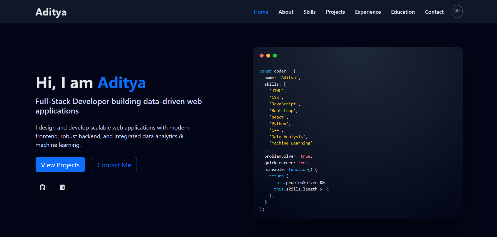
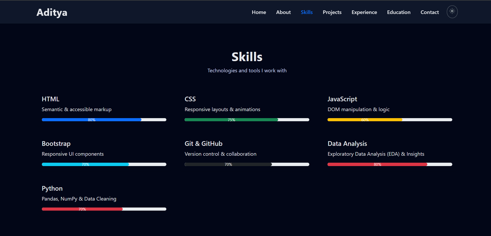
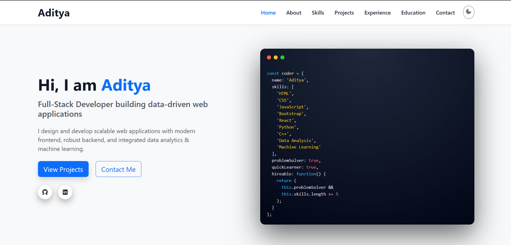

Personal Portfolio Website

This is my personal portfolio website built to showcase my skills, projects, experience, and education as a developer.  
The portfolio is fully responsive, modern, and designed with a clean UI/UX, supporting **dark mode by default**.

**Live Website:** https://adityaportfoli0.netlify.app  
**GitHub Repository:** https://github.com/Adityas234/My-portfolio

---

## ✨ Features

- Single-page responsive layout
- Dark mode enabled by default 🌙
- Smooth scrolling navigation
- Modern UI with Bootstrap & Material-inspired design
- Projects showcase with live & GitHub links
- Experience & education sections
- Functional contact form using 
- SEO-friendly and fast loading

---

## 🛠️ Tech Stack

- **HTML5**
- **CSS3**
- **JavaScript (ES6+)**
- **Bootstrap 5**
- **Material Icons**
- **Netlify** (Hosting & Forms)

---

## 📁 Project Structure

